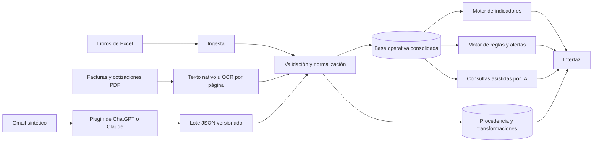

# Faro: inteligencia operativa para pymes

> **Reto:** R4 — Faro  
> **Área:** Operaciones / Dirección  
> **Evento:** Maratón de IA — Ruta N  
> **Segmento inicial:** micro y pequeñas comercializadoras o distribuidoras de Medellín  
> **Datos:** 100 % sintéticos  
> **Estado:** línea base sintética, recuperación PDF/OCR y extracción estructurada documental implementadas; consolidación operativa pendiente
> **Fecha de corte de la investigación:** 31 de julio de 2026

---

## Resumen

**Faro** es una plataforma de inteligencia operativa para micro y pequeñas empresas que consolida información dispersa —ventas, inventarios, pedidos, facturas y novedades—, valida su calidad y la transforma en indicadores y alertas trazables para apoyar decisiones oportunas.

La selección del reto se sustenta en tres hallazgos:

1. **Las microempresas dominan el tejido empresarial de Antioquia.** En 2025 representaron cerca del **89 %**, con **222.244 unidades activas**. [[1]] [[2]]
2. **El comercio es la actividad empresarial más frecuente.** El comercio al por mayor y al por menor representó **36,08 %** de las empresas del departamento. [[1]]
3. **La adopción tecnológica continúa siendo heterogénea.** Persisten barreras de infraestructura, capacidades, formación y adopción en las empresas micro. [[3]]

> **Propuesta de solución:** consolidar datos operativos, detectar inconsistencias, calcular indicadores mediante reglas determinísticas y presentar alertas explicables con trazabilidad hasta la fuente original.

---

## Contenido

- [1. Justificación del reto](#1-justificación-del-reto)
- [2. Problema y usuarios](#2-problema-y-usuarios)
- [3. Propuesta de valor](#3-propuesta-de-valor)
- [4. Alcance del MVP](#4-alcance-del-mvp)
- [5. Flujo funcional](#5-flujo-funcional)
- [6. Arquitectura](#6-arquitectura)
- [7. Inteligencia artificial, confianza y trazabilidad](#7-inteligencia-artificial-confianza-y-trazabilidad)
- [8. Estructura final del repositorio](#8-estructura-final-del-repositorio)
- [9. Documentación canónica](#9-documentación-canónica)
- [10. Instalación, ejecución y pruebas](#10-instalación-ejecución-y-pruebas)
- [11. Reproducibilidad y evaluación](#11-reproducibilidad-y-evaluación)
- [12. Estado del proyecto](#12-estado-del-proyecto)
- [13. Referencias](#13-referencias)

---

## 1. Justificación del reto

### 1.1 Pregunta de investigación

> **¿Cuál de los retos propuestos responde mejor a las características del tejido empresarial de Medellín y Antioquia, representa un problema frecuente y permite construir un MVP diferenciador, verificable y técnicamente viable durante la Maratón de IA?**

### 1.2 Contexto empresarial

Las cifras utilizadas pertenecen a tres universos diferentes y no deben interpretarse como si describieran la misma población:

- **Antioquia:** totalidad del departamento.
- **Medellín:** municipio de Medellín.
- **Jurisdicción de la Cámara de Comercio de Medellín para Antioquia:** Medellín y los demás municipios bajo su cobertura registral.

Durante 2025:

- Antioquia registró aproximadamente **251.000 empresas**. [[1]]
- Las microempresas alcanzaron **222.244 unidades activas**, cerca del **89 %** del tejido empresarial departamental. [[2]]
- Medellín registró **125.569 empresas**, frente a 118.441 en 2024. [[4]]
- La jurisdicción de la Cámara de Comercio de Medellín para Antioquia reportó **169.050 empresas**, de las cuales **97,3 %** correspondían a micro y pequeñas empresas. [[5]]

### 1.3 Sectores con mayor participación

| Actividad económica | Participación en Antioquia, 2025 |
|---|---:|
| Comercio al por mayor y al por menor; reparación de vehículos y motocicletas | **36,08 %** |
| Alojamiento y servicios de comida | **12,67 %** |
| Industrias manufactureras | **11,48 %** |
| Actividades profesionales, científicas y técnicas | **7,42 %** |
| Actividades inmobiliarias | **5,32 %** |
| Construcción | **4,78 %** |
| Otras actividades de servicios | **4,23 %** |
| Servicios administrativos y de apoyo | **4,15 %** |
| Información y comunicaciones | **2,53 %** |
| Otras actividades | **11,34 %** |

Fuente: Informe de Gestión 2025 de la Cámara de Comercio de Medellín para Antioquia. [[1]]

### 1.4 Comparación de alternativas

La matriz es una evaluación propia del proyecto y no una clasificación oficial de Ruta N.

| Criterio | Peso |
|---|---:|
| Alcance potencial en el mercado local | 20 % |
| Frecuencia y relevancia del problema | 20 % |
| Viabilidad del MVP | 20 % |
| Posibilidad de diferenciación | 15 % |
| Ajuste con las capacidades técnicas | 15 % |
| Riesgo operativo y regulatorio controlable | 10 % |

| Reto | Mercado | Problema | MVP | Diferenciación | Ajuste técnico | Riesgo | Resultado |
|---|---:|---:|---:|---:|---:|---:|---:|
| R1 — Centinela | 5,0 | 4,5 | 4,5 | 3,0 | 4,0 | 4,5 | **4,33 / 5** |
| R3 — Forja | 3,5 | 3,5 | 4,0 | 4,0 | 4,0 | 4,0 | **3,80 / 5** |
| **R4 — Faro** | **5,0** | **5,0** | **4,2** | **4,5** | **5,0** | **4,0** | **4,67 / 5** |
| R5 — Cuadre | 5,0 | 5,0 | 2,5 | 3,8 | 4,0 | 2,0 | **3,87 / 5** |

### 1.5 Decisión

Se selecciona **R4 — Faro** porque:

- atiende un problema transversal a distintos sectores;
- se relaciona directamente con el comercio, la actividad de mayor participación empresarial;
- permite demostrar un flujo completo de entrada, validación, consolidación, detección y decisión;
- produce resultados cuantificables y verificables;
- aprovecha capacidades de backend, bases de datos, ETL, calidad de datos y analítica;
- presenta menor exposición regulatoria que una solución financiera integral;
- puede diferenciarse mediante calidad de datos, explicabilidad y trazabilidad.

La investigación justifica la selección inicial. Las hipótesis del problema deberán validarse con entrevistas, pruebas de uso y evaluación del MVP.

---

## 2. Problema y usuarios

### Segmento inicial

> **Micro o pequeña empresa comercializadora o distribuidora de alimentos, bebidas, productos de aseo o insumos empresariales ubicada en Medellín.**

Este segmento maneja productos, ventas, inventarios, compras, pedidos y proveedores; genera datos estructurados y semiestructurados; y permite construir un escenario sintético comprensible y medible.

### Usuario principal

**Propietario, administrador o coordinador operativo** que necesita responder preguntas del negocio sin consolidar manualmente múltiples archivos y documentos.

### Usuarios secundarios

- responsable de ventas;
- auxiliar administrativo;
- encargado de inventarios;
- responsable de compras;
- analista o asesor externo.

### Problema central

> Las micro y pequeñas empresas pueden producir información suficiente para operar, pero no necesariamente cuentan con mecanismos para integrarla, validarla y convertirla oportunamente en decisiones verificables.

### Causas de diseño por validar

- diferentes libros y plantillas de Excel;
- ingreso manual de datos;
- ausencia de identificadores únicos;
- registros duplicados o incompletos;
- documentos PDF no estructurados;
- pedidos y novedades recibidos por correo;
- dependencia de una persona para consolidar reportes;
- ausencia de trazabilidad entre indicadores y fuentes.

### Efectos esperados

- retrasos en la generación de reportes;
- decisiones con información incompleta;
- errores de inventario;
- duplicación de facturas o registros;
- dificultad para identificar tendencias;
- alertas tardías;
- pérdida de confianza en los datos.

---

## 3. Propuesta de valor

> **Para propietarios y administradores de pequeñas empresas comerciales que necesitan tomar decisiones con información dispersa, Faro consolida archivos y documentos operativos, valida su calidad y genera indicadores y alertas trazables, sin exigir la implementación inicial de un ERP completo.**

### Diferenciadores

1. **Integración gradual:** parte de los archivos que la empresa ya utiliza.
2. **Calidad de datos:** identifica errores antes de generar indicadores.
3. **Trazabilidad:** cada resultado conserva su fuente y transformación.
4. **Determinismo:** los cálculos críticos se ejecutan mediante código verificable.
5. **Explicabilidad:** las alertas muestran la evidencia que las sustenta.
6. **Control humano:** la IA no aprueba decisiones sensibles de forma autónoma.
7. **Reproducibilidad:** el escenario puede reconstruirse con datos sintéticos y comandos versionados.

---

## 4. Alcance del MVP

### Entradas sintéticas

- `catalogos.xlsx`, con productos, clientes y proveedores;
- `ventas.xlsx`;
- `inventario.xlsx`;
- `pedidos.xlsx`;
- facturas y cotizaciones PDF con texto nativo, escaneado o mixto;
- lote JSON producido por un plugin de Gmail en ChatGPT o Claude.

### Capacidades incluidas

- cargar libros de Excel;
- recuperar texto por página mediante extracción nativa u OCR y clasificar facturas y cotizaciones;
- extraer campos estructurados y validar líneas y totales de facturas y cotizaciones;
- importar y validar el lote estructurado producido por el plugin de correo;
- validar esquemas, tipos, fechas y campos obligatorios;
- detectar duplicados e inconsistencias conocidas;
- normalizar nombres e identificadores;
- consolidar la información en un modelo común;
- calcular indicadores operativos;
- generar alertas mediante reglas determinísticas;
- mostrar la evidencia que respalda cada alerta;
- responder preguntas prioritarias con datos recuperados;
- registrar el origen y las transformaciones de los datos.

### Indicadores iniciales

- ventas totales del periodo;
- variación frente al periodo anterior;
- productos más vendidos;
- productos con bajo inventario;
- pedidos con diferencias;
- facturas posiblemente duplicadas;
- proveedores con información inconsistente.

### Fuera del alcance

- contabilidad completa;
- facturación electrónica ante la DIAN;
- conciliación bancaria real;
- automatización de pagos;
- ERP o CRM completo;
- pronósticos avanzados;
- operación autónoma sin revisión humana;
- uso de información empresarial real durante la Maratón.

### Objetivos de validación

| Dimensión | Objetivo del MVP |
|---|---|
| Ingesta | Procesar al menos 95 % de los archivos sintéticos válidos |
| Calidad | Detectar al menos 90 % de las anomalías sembradas |
| Trazabilidad | Respaldar 100 % de las alertas con una fuente identificable |
| Consultas | Respaldar 100 % de las respuestas numéricas con datos estructurados |
| Utilidad | Resolver al menos cinco preguntas operativas prioritarias |
| Tiempo | Completar el escenario de consolidación en menos de cinco minutos |

Estos valores son objetivos; no representan resultados obtenidos todavía.

---

## 5. Flujo funcional

1. El usuario carga los libros de Excel y las facturas o cotizaciones PDF sintéticas.
2. ChatGPT o Claude consulta Gmail mediante un plugin y produce un lote JSON versionado.
3. Faro registra los metadatos y conserva las fuentes y artefactos sin modificarlos.
4. Los módulos de ingesta, extracción y validación convierten las fuentes a estructuras normalizadas.
5. El motor de calidad identifica errores, faltantes, duplicados e inconsistencias.
6. Los datos válidos se consolidan sin sobrescribir las fuentes originales.
7. Los motores determinísticos calculan indicadores y alertas.
8. La interfaz muestra resultados, reglas aplicadas y evidencia de origen.
9. La IA interpreta preguntas y explica resultados ya verificados.



---

## 6. Arquitectura

### Principios

- separar datos crudos, procesados y resultados esperados;
- conservar la procedencia de cada registro;
- mantener los cálculos críticos fuera del modelo generativo;
- exigir revisión humana cuando una extracción o correspondencia sea incierta;
- favorecer componentes simples, modulares y comprobables;
- ejecutar localmente en Ubuntu con dependencias versionadas;
- preservar interfaces públicas y reglas de negocio mediante pruebas.

### Módulos principales

| Módulo | Responsabilidad |
|---|---|
| `ingestion` | Recibir archivos y registrar metadatos |
| `extraction` | Inspeccionar PDF, recuperar texto nativo u OCR, clasificar documentos y preservar evidencia |
| `synthetic` | Generar y validar la línea base sintética determinística |
| `quality` | Validar esquemas, tipos, rangos y duplicados |
| `normalization` | Unificar formatos, nombres e identificadores |
| `persistence` | Guardar datos procesados y relaciones |
| `provenance` | Conservar fuente, ubicación, transformación y regla |
| `indicators` | Calcular indicadores operativos |
| `alerts` | Aplicar reglas y priorizar anomalías |
| `ai` | Interpretar, recuperar y explicar con evidencia |
| `api` | Exponer casos de uso y resultados |
| `ui` | Mostrar indicadores, alertas, fuentes y explicaciones |

El diseño detallado se mantiene en [`docs/architecture/system-design.md`](docs/architecture/system-design.md).

---

## 7. Inteligencia artificial, confianza y trazabilidad

> **La IA interpreta y explica; el backend valida y calcula.**

### Uso previsto de IA

- interpretar preguntas en lenguaje natural;
- extraer campos de documentos semiestructurados;
- proponer correspondencias entre nombres o columnas;
- clasificar mensajes y novedades;
- resumir hallazgos verificados;
- explicar indicadores y alertas;
- reconocer cuándo la evidencia es insuficiente.

### Funciones determinísticas

Los totales, porcentajes, reglas de inventario, detección final de duplicados, indicadores y restricciones de negocio se implementan mediante código o SQL comprobable.

Cada alerta y respuesta numérica debe conservar:

- archivo de origen;
- hoja, página o mensaje;
- registro relacionado;
- transformación aplicada;
- regla o consulta ejecutada;
- nivel de confianza cuando intervenga extracción asistida por IA.

Los procedimientos especializados se mantienen fuera del README:

- [`skills/faro-scope-guardian/SKILL.md`](skills/faro-scope-guardian/SKILL.md)
- [`skills/faro-synthetic-data-designer/SKILL.md`](skills/faro-synthetic-data-designer/SKILL.md)
- [`skills/faro-data-quality-auditor/SKILL.md`](skills/faro-data-quality-auditor/SKILL.md)
- [`skills/faro-demo-reviewer/SKILL.md`](skills/faro-demo-reviewer/SKILL.md)

---

## 8. Estructura final del repositorio

```text
R4-FARO-OPERACIONES_DIRECCION/
├── README.md
├── LICENSE
├── Makefile
├── pyproject.toml
├── uv.lock
├── .env.example
├── .gitignore
├── .pre-commit-config.yaml
├── AGENTS.md
├── CLAUDE.md
│
├── .github/
│   └── workflows/
│       └── ci.yml
│
├── config/
│   ├── app.example.yaml
│   ├── data-quality-rules.yaml
│   └── indicators.yaml
│
├── src/
│   └── faro/
│       ├── __init__.py
│       ├── main.py
│       ├── settings.py
│       ├── api/
│       ├── domain/
│       ├── ingestion/
│       ├── extraction/
│       │   ├── classifier.py
│       │   ├── errors.py
│       │   ├── ocr.py
│       │   ├── pdf.py
│       │   └── service.py
│       ├── quality/
│       ├── normalization/
│       ├── persistence/
│       ├── provenance/
│       ├── indicators/
│       ├── alerts/
│       ├── ai/
│       ├── synthetic/
│       │   ├── formats.py
│       │   ├── generator.py
│       │   └── validator.py
│       └── ui/
│
├── tests/
│   ├── unit/
│   ├── integration/
│   ├── e2e/
│   └── fixtures/
│
├── data/
│   ├── README.md
│   ├── raw/
│   │   ├── catalogos.xlsx
│   │   ├── ventas.xlsx
│   │   ├── inventario.xlsx
│   │   ├── pedidos.xlsx
│   │   └── facturas/
│   ├── processed/
│   ├── expected/
│   │   ├── expected_anomalies.json
│   │   └── dataset_manifest.json
│   └── samples/
│       └── plugin-email-batch.example.json
│
├── scripts/
│   ├── check_ocr_runtime.py
│   ├── extract_pdf.py
│   ├── generate_synthetic_data.py
│   ├── validate_dataset.py
│   └── run_demo.py
│
├── schemas/
│   └── plugin-email-batch.schema.json
├── prompts/
│   └── email-plugin-extraction.md
│
├── docs/
│   ├── research/
│   │   └── market-analysis.md
│   ├── product/
│   │   ├── problem-statement.md
│   │   ├── requirements.md
│   │   ├── mvp-scope.md
│   │   └── use-cases.md
│   ├── architecture/
│   │   └── system-design.md
│   ├── data/
│   │   ├── data-contracts.md
│   │   └── data-dictionary.md
│   ├── decisions/
│   │   ├── README.md
│   │   ├── 0001-support-scanned-pdf-ocr.md
│   │   └── 0002-select-local-pdf-ocr-stack.md
│   ├── evaluation/
│   │   ├── validation-plan.md
│   │   ├── smart-ranks.md
│   │   └── ai-usage-log.md
│   ├── demo/
│   │   └── demo-script.md
│   └── ai/
│       └── project-instructions.md
│
└── skills/
    ├── faro-scope-guardian/
    │   └── SKILL.md
    ├── faro-synthetic-data-designer/
    │   └── SKILL.md
    ├── faro-data-quality-auditor/
    │   └── SKILL.md
    └── faro-demo-reviewer/
        └── SKILL.md
```

### Criterios de organización

- Se utiliza el patrón **`src` layout** para aislar el paquete instalable del repositorio.
- Los módulos de dominio se separan de la interfaz y de las integraciones.
- Las reglas configurables permanecen fuera del código en `config/`.
- Los datos crudos nunca se sobrescriben.
- Las pruebas se separan por alcance: unitarias, integración y extremo a extremo.
- La documentación detallada se organiza por responsabilidad.
- Las Skills son procedimientos independientes y se cargan únicamente cuando resultan necesarias.
- `AGENTS.md` y `CLAUDE.md` son archivos breves de enrutamiento, no copias completas de las especificaciones.

---

## 9. Documentación canónica

| Ruta | Responsabilidad |
|---|---|
| `README.md` | Visión general, justificación, estado y mapa del repositorio |
| `docs/research/market-analysis.md` | Investigación empresarial y fuentes completas |
| `docs/product/problem-statement.md` | Problema, usuarios e hipótesis |
| `docs/product/requirements.md` | Requisitos y criterios de aceptación |
| `docs/product/mvp-scope.md` | Inclusiones, exclusiones y prioridades |
| `docs/product/use-cases.md` | Casos de uso y flujos funcionales |
| `docs/architecture/system-design.md` | Arquitectura, componentes e interfaces |
| `docs/data/data-contracts.md` | Esquemas, formatos y contratos de entrada/salida |
| `docs/data/data-dictionary.md` | Campos, reglas y relaciones |
| `docs/decisions/` | Decisiones arquitectónicas y de producto |
| `docs/evaluation/validation-plan.md` | Estrategia y métricas de validación |
| `docs/evaluation/smart-ranks.md` | Reglas confirmadas de evaluación |
| `docs/evaluation/ai-usage-log.md` | Registro conciso de decisiones asistidas por IA |
| `docs/demo/demo-script.md` | Guion, evidencia y contingencias del Demo Day |
| `docs/ai/project-instructions.md` | Copia versionada de las instrucciones del Project |
| `skills/*/SKILL.md` | Procedimientos repetibles especializados |
| `config/*.yaml` | Reglas operativas configurables |
| `tests/` | Evidencia ejecutable del comportamiento esperado |

### Fuente de verdad

En caso de conflicto se aplica este orden:

1. reglas oficiales del reto y de evaluación;
2. `docs/product/requirements.md` y `docs/product/mvp-scope.md`;
3. decisiones aprobadas en `docs/decisions/`;
4. contratos de datos, anomalías esperadas y pruebas;
5. código implementado;
6. resumen del README;
7. respuestas de asistentes de IA.

No se duplicarán especificaciones completas entre README, instrucciones del Project, Skills, prompts y comentarios de código.

---

## 10. Instalación, ejecución y pruebas

Dependencias del sistema para PDF y OCR en Ubuntu:

```bash
sudo apt update
sudo apt install -y poppler-utils tesseract-ocr tesseract-ocr-spa
```

Interfaz actual de operación:

```bash
make setup
make check-ocr-runtime
make generate-data
make validate-data
make check
make extract-pdf PDF=data/raw/facturas/factura_001.pdf
make run
```

| Comando | Propósito |
|---|---|
| `make setup` | Crear el entorno e instalar dependencias bloqueadas |
| `make check-ocr-runtime` | Verificar Poppler, Tesseract y el idioma español |
| `make generate-data` | Generar o reutilizar la línea base sintética con semilla fija |
| `make validate-data` | Comparar los 11 hallazgos sembrados con la verdad de referencia |
| `make check` | Compilar y ejecutar las pruebas unitarias y de integración |
| `make extract-pdf PDF=...` | Recuperar texto, método, clasificación y procedencia de un PDF |
| `make run` | Iniciar la aplicación local |

Los comandos solo se considerarán disponibles cuando sus objetivos existan, hayan sido ejecutados y estén documentados con sus resultados reales.

La configuración local utilizará `.env`; únicamente `.env.example` podrá versionarse. No se incluirán credenciales en el repositorio.

---

## 11. Reproducibilidad y evaluación

La entrega deberá conservar:

- versión de Python y dependencias bloqueadas;
- semilla fija para los datos sintéticos;
- verdad de referencia de las anomalías sembradas;
- separación entre datos crudos, procesados y esperados;
- comandos exactos de instalación, generación, pruebas y ejecución;
- resultados esperados;
- limitaciones conocidas;
- historial Git y versión de referencia;
- procedencia de cada alerta y respuesta numérica.

La información pública de Smart Ranks indica que la evaluación considera el proceso de resolución, las herramientas, las correcciones, los criterios cumplidos y la reproducibilidad, además del producto final. [[6]]

La compatibilidad directa de Smart Ranks con ChatGPT o Codex se tratará como **no confirmada** hasta recibir comunicación escrita de la organización. No se fabricará ni simulará un historial de Claude o Smart Ranks.

### Convención de idioma y eficiencia

- **Inglés:** código, identificadores, pruebas, comentarios, instrucciones de agentes y documentación técnica interna.
- **Español:** respuestas al participante, README y materiales de negocio o Demo Day.
- Los agentes deben leer primero este README y abrir únicamente los archivos necesarios para la tarea.
- Las Skills no deben precargarse ni reproducirse fuera de sus archivos.
- Las decisiones permanentes deben registrarse en archivos canónicos y no depender del historial de un chat.

---

## 12. Estado del proyecto

| Componente | Estado |
|---|---|
| Investigación y selección de R4 — Faro | `implemented` |
| Segmento y problema inicial | `implemented` |
| Alcance preliminar del MVP | `implemented` |
| Estructura final del repositorio | `implemented` |
| Reglas oficiales de Smart Ranks para ChatGPT/Codex | `planned` |
| Datos sintéticos y verdad de referencia | `implemented` |
| Recuperación de texto PDF/OCR y clasificación documental | `implemented` |
| Extracción estructurada de campos de factura y cotización | `planned` |
| Ingesta y validación tabular | `planned` |
| Consolidación y proveniencia | `planned` |
| Indicadores y alertas | `planned` |
| Consultas asistidas por IA | `planned` |
| Interfaz y Demo Day | `planned` |
| ERP, CRM, contabilidad e integraciones bancarias | `out of scope` |

Una funcionalidad se considerará terminada únicamente cuando cumpla sus criterios de aceptación, tenga pruebas, conserve trazabilidad, esté documentada de forma consistente y pueda reproducirse.

---

## 13. Referencias

1. Cámara de Comercio de Medellín para Antioquia. (2026). *Informe de Gestión 2025*. <https://www.camaramedellin.com.co/Portals/0/Documentos/2026/Informe_Gestion_CCMA_2025.pdf>

2. Centro de Estudios de la Empresa Micro. (2026). *Resultados Encuesta Empresa Micro 2025*. Cámara de Comercio de Medellín para Antioquia. <https://biblioteca.camaramedellin.com.co/resultados-encuesta-empresa-micro-2025>

3. Centro de Estudios de la Empresa Micro. (2025). *Adopción de tecnologías digitales en la empresa micro del Valle de Aburrá*. Cámara de Comercio de Medellín para Antioquia. <https://biblioteca.camaramedellin.com.co/adopcion-de-tecnologias-digitales-en-la-empresa-micro-del-valle-de-aburra>

4. Cámara de Comercio de Medellín para Antioquia. (2026). *Caracterización empresarial de Bello*. La Tabla 8 presenta la evolución del número de empresas de Medellín entre 2023 y 2025. <https://www.camaramedellin.com.co/Portals/0/Documentos/2026/Cartilla_Bello.pdf>

5. Cámara de Comercio de Medellín para Antioquia. (2026). *Cifras destacadas del Informe de Gestión 2025*. <https://www.camaramedellin.com.co/Portals/0/Documentos/2026/Cifras_Destacadas_Informe_CCMA_2026.pdf>

6. Smart4AI. (2026). *Smart Ranks: verificación de competencia en IA aplicada*. <https://smart4ai.io/smart-ranks>

7. OpenAI. (2026). *Using Codex with your ChatGPT plan*. <https://help.openai.com/en/articles/11369540-using-codex-with-your-chatgpt-plan>

8. OpenAI. (2026). *Projects in ChatGPT*. <https://help.openai.com/en/articles/10169521-projects-in-chatgpt>

9. OpenAI. (2026). *Skills in ChatGPT*. <https://help.openai.com/en/articles/20001066>

10. OpenAI. (2026). *What are tokens and how to count them?* <https://help.openai.com/en/articles/4936856-what-are-tokens-and-how-to-count-them>

---

## Licencia y uso

Este repositorio se prepara como soporte de investigación, diseño, implementación y evaluación para la Maratón de IA de Ruta N. Las cifras externas pertenecen a sus respectivas fuentes. La matriz de decisión, las hipótesis, la arquitectura y el alcance representan decisiones del proyecto y deberán validarse durante el desarrollo.
